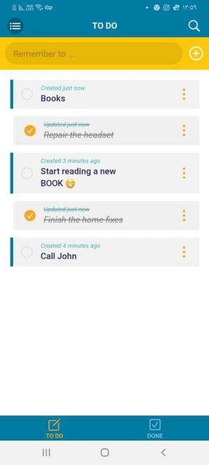
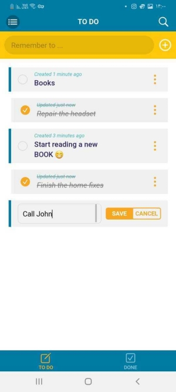
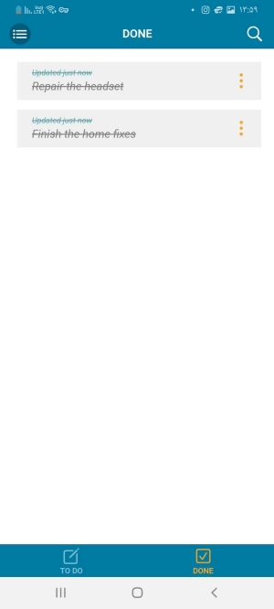
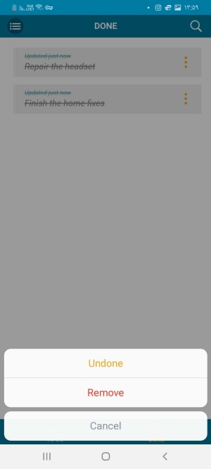

# Todo

Todo is a simple [PWA](https://developer.mozilla.org/en-US/docs/Web/Progressive_web_apps) for managing your everyday notes and tasks to not forget about. It uses browser IndexedDB for storing your notes, so you can use it completely in offline mode. You just need to open it the fisrt time and install it to your phone or desktop environment. Every time you go online and reopen the app, it will be automatically updated in background to the latest changes.

## Screenshots







## Frameworks and Tools

Todo app has been developed with simple but great [Vue.js](https://vuejs.org/) framework. Also, [Framework7](https://framework7.io/) has been used for the UI part. For storing and managing of todos, [Dexie.js](https://dexie.org/) has been used. It is a minimalistic wrapper for IndexedDB, which makes the app to be able to work completely offline using your browser storage.

## Project Setup
 
```sh
npm install
```

## Compile and Hot-Reload for Development

```sh
npm run dev
```

## Compile and Minify for Production

```sh
npm run build
```

## Lint with [ESLint](https://eslint.org/)

```sh
npm run lint
```

## Deploy to Github Pages
```sh
npm run deploy
```
